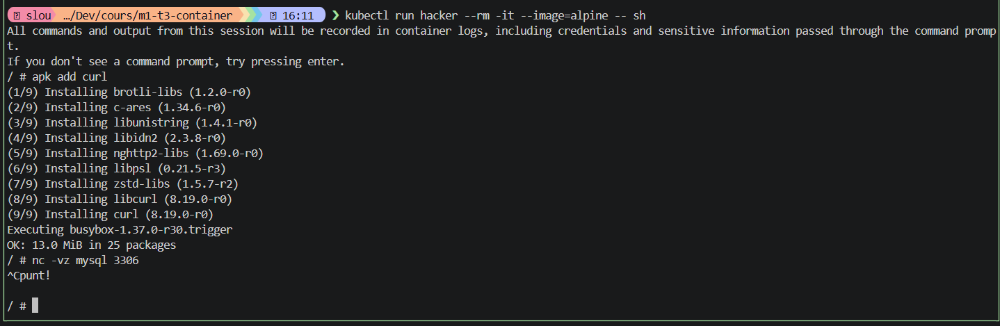

# TP Kubernetes — Kind + phpMyAdmin + MySQL + Dashboard

---

## Cluster Kind

### Créer le cluster

```bash
kind create cluster --config kind-cluster.yaml --name tp-kube
```

```bash
kubectl get nodes
```

Installer kalico
```bash
kubectl apply -f https://raw.githubusercontent.com/projectcalico/calico/v3.27.0/manifests/calico.yaml
```

---

## phpMyAdmin + MySQL

### Fichiers concernés

- `01-configmap-pma.yaml` — `PMA_ARBITRARY=1`, `PMA_HOSTS=mysql`
- `03-mysql.yaml` — Deployment MySQL (`envFrom: secretRef`) + Service
- `04-phpmyadmin.yaml` — Deployment phpMyAdmin (`envFrom: configMapRef` + `secretRef`) + Service

### Créer les secrets

```bash
kubectl create secret generic mysql-secret \
  --from-literal=MYSQL_ROOT_PASSWORD=R00tP@ssw0rd! \
  --from-literal=MYSQL_DATABASE=appdb \
  --from-literal=MYSQL_USER=appuser \
  --from-literal=MYSQL_PASSWORD=S3cr3tP@ss!

kubectl create secret generic pma-secret \
  --from-literal=PMA_USER=root \
  --from-literal=PMA_PASSWORD=R00tP@ssw0rd!
```

### Déployer

```bash
kubectl apply -f 01-configmap-pma.yaml \
              -f 03-mysql.yaml \
              -f 04-phpmyadmin.yaml
```

### Secrets utilisés

| Secret | Clés | Utilisé par |
|--------|------|-------------|
| `mysql-secret` | MYSQL_ROOT_PASSWORD, MYSQL_DATABASE, MYSQL_USER, MYSQL_PASSWORD | MySQL (`envFrom`) |
| `pma-secret` | PMA_USER, PMA_PASSWORD | phpMyAdmin (`envFrom`) |

### ConfigMap utilisée

| ConfigMap | Clés | Utilisé par |
|-----------|------|-------------|
| `phpmyadmin-config` | PMA_ARBITRARY=1, PMA_HOSTS=mysql | phpMyAdmin (`envFrom`) |

---

## Persistance MySQL

### Fichier concerné

- `02-mysql-pvc.yaml` — PVC `mysql-data` 1Gi RWO, monté sur `/var/lib/mysql`

### Déployer

```bash
kubectl apply -f 02-mysql-pvc.yaml
```


Pour la HA 


### Tester la persistance (après étape 4)

1. Aller sur http://pma.local, se connecter avec `root` / `R00tP@ssw0rd!`
2. Créer une base de données test (ex: `testdb`)
3. Supprimer le pod :
   ```bash
   kubectl delete pod -l app=mysql
   ```
4. Attendre le redémarrage :
   ```bash
   kubectl get pod -l app=mysql -w
   ```
5. Retourner sur phpMyAdmin → `testdb` doit toujours être présente ✅

---

## Gateway Traefik (HTTPRoute)

### Fichiers concernés

- `05-gateway.yaml` — `GatewayClass` + `Gateway` (port 80, `allowedRoutes: All`)
- `06-httproute-pma.yaml` — `HTTPRoute` → `pma.local` → phpMyAdmin:80

### Installer les CRDs Gateway API

```bash
kubectl apply -f https://github.com/kubernetes-sigs/gateway-api/releases/download/v1.5.1/standard-install.yaml
```

### Installer Traefik via Helm

```bash
helm repo add traefik https://traefik.github.io/charts
helm repo update
kubectl label node tp-kube-control-plane gateway-host=true

helm install traefik traefik/traefik \
  --namespace traefik \
  --create-namespace \
  --set providers.kubernetesGateway.enabled=true \
  --set gateway.enabled=false \
  --set "tolerations[0].key=node-role.kubernetes.io/control-plane" \
  --set "tolerations[0].effect=NoSchedule" \
  --set-string "nodeSelector.gateway-host=true" \
  --set ports.web.hostPort=80 \
  --set ports.websecure.hostPort=443
```

### Déployer la Gateway et la route

```bash
kubectl apply -f 05-gateway.yaml \
              -f 06-httproute-pma.yaml
```

### Configurer /etc/hosts

```bash
echo "127.0.0.1 pma.local dashboard.pma.local" | sudo tee -a /etc/hosts
```

### Accéder à phpMyAdmin

```
http://pma.local
```

---

## NetworkPolicy

### Fichier concerné

- `07-networkpolicy.yaml` — seul `app=phpmyadmin` peut joindre `app=mysql` sur 3306

### Déployer

```bash
kubectl apply -f 07-networkpolicy.yaml
```

### Tester depuis un pod lambda (doit échouer)

```bash
kubectl run hacker --rm -it --image=alpine -- sh
# Dans le shell :
apk add --no-cache netcat-openbsd
nc -vz mysql 3306
# → nc: connect to mysql port 3306 (tcp) failed ✅
```



Pour la partie PHP my admin j'ai F5 et ça marchait toujours 

### Tester depuis phpMyAdmin (doit fonctionner)

F5 l'interfce web

---

## TP7 — Dashboard Kite

### Fichiers concernés

- `dashboard/01-serviceaccount.yaml` — ServiceAccount `admin-user` + ClusterRoleBinding `cluster-admin`
- `dashboard/02-httproute.yaml` — `HTTPRoute` (kube-system) → `dashboard.pma.local` → kite:8080

### Installer Kite

```bash
kubectl apply -f https://raw.githubusercontent.com/kite-org/kite/refs/heads/main/deploy/install.yaml
```

### Déployer le ServiceAccount et la route

```bash
kubectl apply -f dashboard/
```

### Générer un token

```bash
kubectl create token admin-user -n kube-system --duration=24h
```

### Accéder au dashboard

```
http://dashboard.pma.local
```

