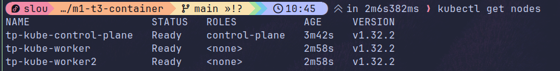
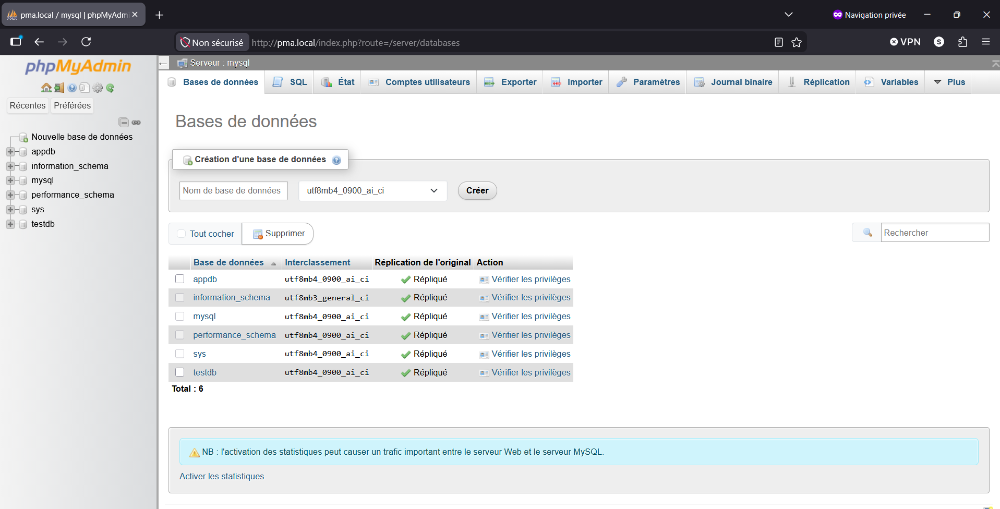
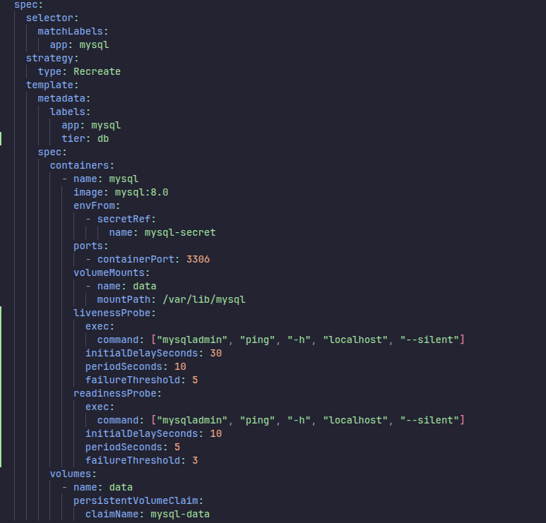
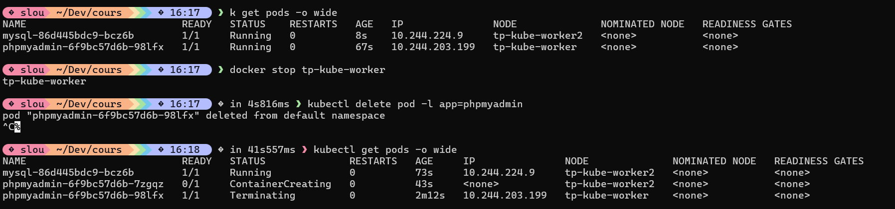
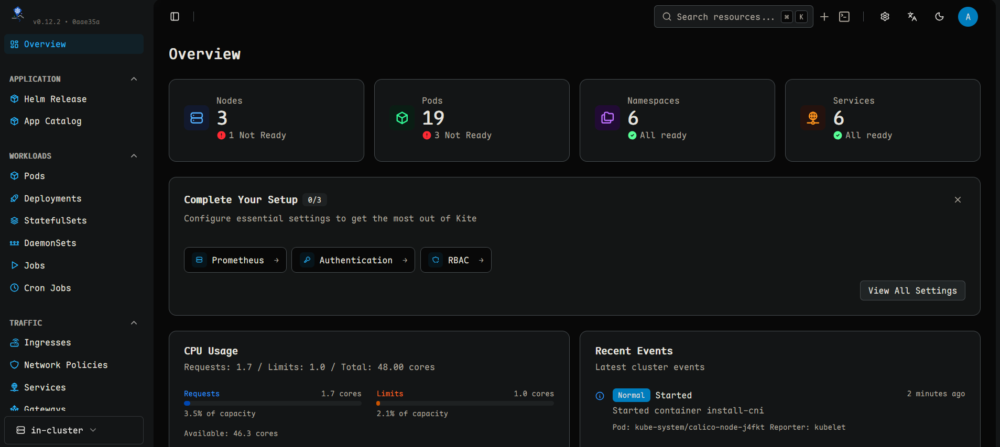

# TP Kubernetes — Kind + phpMyAdmin + MySQL + Dashboard

> Docs : [Sujet](sujet.md) · [Grille d'évaluation](grille-evaluation.md)

---

## Cluster Kind

```bash
kind create cluster --config kind-cluster.yaml --name tp-kube
kubectl get nodes
```

Installer Calico (CNI) :

```bash
kubectl apply -f https://raw.githubusercontent.com/projectcalico/calico/v3.27.0/manifests/calico.yaml
```

`01-nodes`


---

## Étape 1 — Gateway API + Traefik

Installer les CRDs Gateway API :

```bash
kubectl apply -f https://github.com/kubernetes-sigs/gateway-api/releases/download/v1.5.1/standard-install.yaml
```

Installer Traefik via Helm :

```bash
helm repo add traefik https://traefik.github.io/charts
helm repo update
kubectl label node tp-kube-control-plane gateway-host=true

helm install traefik traefik/traefik \
  --namespace traefik \
  --create-namespace \
  --set providers.kubernetesGateway.enabled=true \
  --set gateway.enabled=false \
  --set "tolerations[0].key=node-role.kubernetes.io/control-plane" \
  --set "tolerations[0].effect=NoSchedule" \
  --set-string "nodeSelector.gateway-host=true" \
  --set ports.web.hostPort=80 \
  --set ports.websecure.hostPort=443
```

Ajouter les hostnames locaux :

```bash
echo "127.0.0.1 pma.local dashboard.pma.local" | sudo tee -a /etc/hosts
```

---

## Partie 1 — MySQL + phpMyAdmin

### Secrets

Les mots de passe ne sont jamais en clair dans les YAML — ils sont injectés via des `Secret` Kubernetes créés une seule fois :

```bash
kubectl apply -f ressources/00-namespace.yaml
kubectl create secret generic mysql-secret \
  -n projet-pma \
  --from-literal=MYSQL_ROOT_PASSWORD=R00tP@ssw0rd! \
  --from-literal=MYSQL_DATABASE=appdb \
  --from-literal=MYSQL_USER=appuser \
  --from-literal=MYSQL_PASSWORD=S3cr3tP@ss!

kubectl create secret generic pma-secret \
  -n projet-pma \
  --from-literal=PMA_USER=root \
  --from-literal=PMA_PASSWORD=R00tP@ssw0rd!
```

| Secret | Clés | Utilisé par |
|--------|------|-------------|
| `mysql-secret` | MYSQL_ROOT_PASSWORD, MYSQL_DATABASE, MYSQL_USER, MYSQL_PASSWORD | MySQL (`envFrom: secretRef`) |
| `pma-secret` | PMA_USER, PMA_PASSWORD | phpMyAdmin (`envFrom: secretRef`) |

### Déployer

```bash
kubectl apply -f ressources/mysql/
kubectl apply -f ressources/pma/
```

Attendre que tout soit `Running` (mysql prend ~3 mins):

```bash
kubectl get pods -n projet-pma -w
```

Accéder à phpMyAdmin : **http://pma.local** — login `root` / `R00tP@ssw0rd!`, host `mysql`

`02-phpmyadmin-connected`


---

### Persistance MySQL

Le PVC `mysql-data` (1Gi, RWO) est monté sur `/var/lib/mysql` — les données survivent à la suppression du pod.

**Tester :**
1. Se connecter sur http://pma.local et créer une base `testdb`
2. Supprimer le pod :
   ```bash
   kubectl delete pod -l app=mysql -n projet-pma
   ```
3. Attendre le redémarrage :
   ```bash
   kubectl get pod -l app=mysql -n projet-pma -w
   ```
4. Retourner sur phpMyAdmin → `testdb` est toujours là ✅

`03-persistance.png`


---

### Haute disponibilité (HA)

phpMyAdmin tourne avec **2 replicas** répartis sur les workers. Supprimer un pod ne coupe pas le service.

```bash
kubectl delete pod -l app=phpmyadmin -n projet-pma --wait=false
kubectl get pods -n projet-pma -w
```

F5 sur http://pma.local pendant la suppression → toujours accessible ✅


Le test est fait avec mysql solo replicas
`06-ha.png`


---

### NetworkPolicy

Seuls les pods `app=phpmyadmin` peuvent joindre `app=mysql` sur le port 3306. Tout autre pod est bloqué.

**Tester le blocage (doit échouer) :**

```bash
kubectl run hacker -n projet-pma --rm -it --image=alpine -- sh
# Dans le shell :
apk add --no-cache netcat-openbsd
nc -vz mysql 3306
# → connect failed ✅
```


**Tester depuis phpMyAdmin (doit fonctionner) :**

F5 sur l'interface web → toujours connecté ✅

---
### ConfigMap

La configuration phpMyAdmin vient exclusivement d'une `ConfigMap` (`ressources/pma/01-configmap-pma.yaml`) :

| Clé | Valeur |
|-----|--------|
| `PMA_ARBITRARY` | `1` — permet de choisir l'hôte au login |
| `PMA_HOSTS` | `mysql` — résolu via DNS interne Kubernetes |

---

### Namespace

Toutes les ressources sont déployées dans le namespace `projet-pma` (créé par `ressources/00-namespace.yaml`) au lieu du namespace `default`.

### Probes

Les deux Deployments ont des probes configurées :

- **MySQL** — liveness + readiness via `mysqladmin ping` (délai initial 30s / 10s)
- **phpMyAdmin** — liveness + readiness via HTTP GET `/` sur le port 80 (délai initial 30s / 10s)

### PodDisruptionBudget

Un PodDisruptionBudget (`ressources/pma/08-pdb-pma.yaml`) garantit qu'au moins 1 replica phpMyAdmin reste disponible pendant une opération de maintenance (drain de nœud, rolling update).

---

## Partie 2 — Dashboard Kite

### Installer Kite

```bash
kubectl apply -f https://raw.githubusercontent.com/kite-org/kite/refs/heads/main/deploy/install.yaml
```

### Déployer

```bash
kubectl apply -f ressources/dashboard/
```

### Générer un token d'accès

```bash
kubectl create token admin-user -n kube-system --duration=24h
```

### Accéder au dashboard

**http://dashboard.pma.local**


